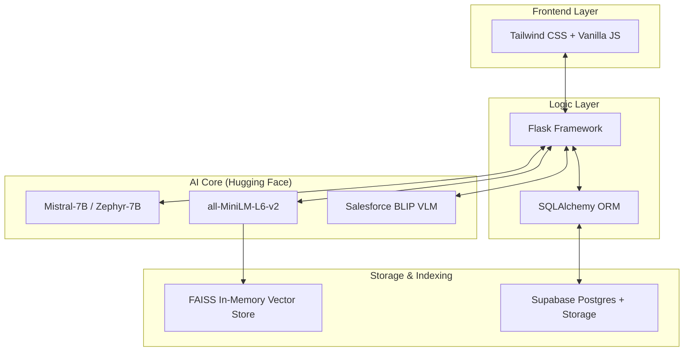

<div align="center">


# 🎓 Unibot.AI
### **The Intelligent Academic Intelligence Layer**
*Bridging the gap between Complex Administration and Student Success with Precise RAG Technology.*

---

[](https://github.com/stebyvarghese1/unibot.ai)
[](https://opensource.org/licenses/MIT)
[](https://www.python.org/)
[](https://flask.palletsprojects.com/)
[](https://huggingface.co/)
[](https://supabase.com/)

[**Explore Documentation**](https://github.com/stebyvarghese1/unibot.ai) • [**View Live Demo**](https://github.com/stebyvarghese1/unibot.ai) • [**Request Feature**](https://github.com/stebyvarghese1/unibot.ai/issues)

</div>

---

## � The Premium RAG Experience

**Unibot.AI** isn't just a chatbot; it's a dedicated **Academic Intelligence Layer**. Developed for universities that demand absolute precision, Unibot leverages **Retrieval-Augmented Generation (RAG)** to serve answers that are 100% grounded in your institution's official documents.

### 🎯 Why It Stands Out
| 🚫 Zero Hallucinations | 🔒 Privacy First | ⚡ Lightning Fast |
| :--- | :--- | :--- |
| Responses are strictly bound to uploaded context. No "internet guessing". | Vector embeddings are ephemeral (In-Memory). Data minimization is enforced. | FAISS + Postgres optimization ensures sub-second retrieval times. |

---

## ✨ Intelligence Features

### 👨‍🎓 For Students: The Ultimate Study Companion
- **Adaptive Academic Querying**: Instant answers about course content, exam dates, and grading criteria.
- **Multimodal Vision Support**: Upload a photo of your timetable or handwritten notes; our **VLM (Salesforce BLIP)** will interpret it for you.
- **Premium Dark Aesthetics**: A sleek, glassmorphic UI built for the modern student.
- **Persistent Knowledge Base**: Seamlessly continue past conversations with integrated session history.

### 🛡️ For Administrators: Absolute Control
- **Unified Document Ingestion**: Native support for **PDF, DOCX, and PPTX** with advanced semantic chunking.
- **Dynamic Web Scraping**: Automatically sync your chatbot with university website updates.
- **In-Memory Vector Management**: Trigger a real-time re-index of the entire library with a single click.
- **Admin Command Center**: A dedicated dashboard for monitoring, document management, and system health.

---

## 📸 Interface Preview

<div align="center">
  <table>
    <tr>
      <td width="50%" align="center"><b>Student Interface (Dark Mode)</b></td>
      <td width="50%" align="center"><b>Session Management</b></td>
    </tr>
    <tr>
      <td></td>
      <td></td>
    </tr>
  </table>
  <p align="center"><b>Administrative Control Center</b></p>
  
</div>

---

## 🛠️ The Powerhouse Tech Stack



---

## 📐 Architecture: How it Works

1. **Semantic Chunking**: Documents aren't just split; they are semantically broken down to ensure context is never lost.
2. **Ephemeral Indexing**: On startup, Unibot converts your library into high-dimensional vectors stored purely in **RAM (FAISS)**.
3. **Similarity Retrieval**: When a student asks a query, Unibot finds the top-$k$ most relevant "knowledge blocks".
4. **Contextual Synthesis**: The LLM synthesizes an answer *only* from those blocks, ensuring 100% accuracy.

---

## 🚀 Rapid Deployment

### 📋 Prerequisites
- **Python 3.10+**
- **Supabase Account** (Postgres & Storage)
- **Hugging Face API Token**

### 🛠️ Setup Instructions

1. **Clone & Initialize**
   ```bash
   git clone https://github.com/stebyvarghese1/unibot.ai.git && cd unibot.ai
   ```

2. **Environment Setup**
   ```bash
   python -m venv venv
   source venv/bin/activate # Windows: venv\Scripts\activate
   pip install -r requirements.txt
   ```

3. **Configure Intelligence**
   Create a `.env` file in the root:
   ```env
   SUPABASE_URL=your_supabase_url
   SUPABASE_KEY=your_supabase_anon_key
   DATABASE_URL=your_postgresql_connection_string
   HUGGINGFACE_API_TOKEN=your_token_here
   HF_LLM_MODEL=mistralai/Mistral-7B-Instruct-v0.2
   ```

4. **Launch Application**
   ```bash
   python run.py
   ```

---

## 🗺️ Roadmap
- [ ] **Multilingual Support**: Expanding to support regional university languages.
- [ ] **Voice Interaction**: Ask Unibot questions using natural speech.
- [ ] **Department Isolation**: Create specific sub-bots for different university faculties.
- [ ] **Analytics Dashboard**: Deep insights for admins on common student queries.

---

## 📄 License & Credits
Distributed under the **MIT License**. 

<div align="center">
  <b>Built for the future of education by Steby Varghese.</b>
  <br />
  <sub>If this project helps you, please consider giving it a ⭐ on GitHub!</sub>
</div>
